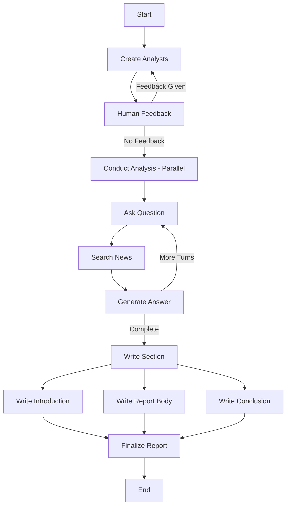

# Research Analyzer: Multi-Analyst News Research System

## Overview

The **Research Analyzer** is a LangGraph-based multi-agent system that creates a team of specialized AI news analysts to conduct comprehensive research on any topic. The system automates the entire research workflow:

1. **Analyst Generation**: Creates a team of specialized analysts with diverse perspectives (Political, Economic, Technical, etc.)
2. **Parallel Research**: Each analyst independently conducts web searches and gathers insights using Tavily
3. **Structured Analysis**: Analysts engage in multi-turn Q&A sessions with an AI expert
4. **Report Synthesis**: Findings are synthesized into a professional report with introduction, analysis, conclusion, and citations

**Key Features:**
- 🤖 Multi-agent architecture with specialized analyst personas
- 🔍 Real-time web search integration via Tavily API
- 📊 Parallel execution of multiple analyst workflows
- 📝 Automatic report generation with proper citations
- 🔄 Human-in-the-loop feedback for analyst refinement

---

## Reason for Picking This Project

This project directly applies and integrates **all major topics** covered in MAT496:

| Course Topic | Implementation in This Project |
|--------------|-------------------------------|
| **Prompting** | Detailed system prompts for analyst creation, question generation, answer synthesis, and report writing |
| **Structured Output** | Pydantic models (NewsAnalyst, AnalystTeam, SearchQuery) with LLM structured output |
| **Semantic Search** | Tavily web search for retrieving relevant news and information |
| **RAG** | Context from web search injected into LLM prompts for grounded answers |
| **Tool Calling LLMs** | Tavily search tool integration for real-time information retrieval |
| **LangGraph: State, Nodes, Graph** | Full implementation with TypedDict states, multiple nodes, conditional edges, and subgraphs |
| **LangSmith** | Compatible with LangSmith for debugging and tracing agent workflows |

The project demonstrates **creativity** by building a practical research automation system that can analyze any topic from multiple expert perspectives - something that previously required significant manual effort.

---

## Video Summary Link

📹 **[Video Demo Link - Add Your YouTube/Google Drive Link Here]**

**Video Contents:**
- Personal introduction with face visible
- Overview of agent functionality (inputs: topic + number of analysts → output: comprehensive research report)
- Explanation of the LangGraph workflow and node interactions
- Live demonstration of the agent analyzing a topic

---

## Plan

- [DONE] Step 1: **Setup & Environment** - Install dependencies (langgraph, langchain_openai, tavily-python) and configure API keys
- [DONE] Step 2: **Data Models** - Define Pydantic models for NewsAnalyst, AnalystTeam, and SearchQuery with structured output
- [DONE] Step 3: **State Definitions** - Create TypedDict states (GenerateAnalystsState, AnalysisState, ResearchGraphState) for LangGraph
- [DONE] Step 4: **Prompt Templates** - Design comprehensive instruction templates for all LLM interactions
- [DONE] Step 5: **Analyst Generation** - Build subgraph for creating specialized analyst personas with human-in-the-loop feedback
- [DONE] Step 6: **Analysis Workflow** - Implement search, question, answer nodes with multi-turn conversation routing
- [DONE] Step 7: **Report Writing** - Create nodes for introduction, body synthesis, and conclusion generation
- [DONE] Step 8: **Full Pipeline** - Assemble complete research graph with parallel execution using Send API

---

## Project Structure

```
MAT-496/
├── Research_Analyzer_Phased.ipynb  # Jupyter notebook with 8 phases
├── research_analyzer.py             # Standalone Python script
├── requirements.txt                 # Dependencies
├── .env.template                    # API key template
├── output_report.md                 # Sample generated report
└── README.md                        # This file
```

---

## How to Run

### 1. Clone and Setup
```bash
git clone https://github.com/Akshat-Gupta1/MAT496-Capstone-2210110135_Akshat.git
cd MAT496-Capstone-2210110135_Akshat
```

### 2. Create Virtual Environment
```bash
python3 -m venv venv
source venv/bin/activate  # Linux/Mac
# or: venv\Scripts\activate  # Windows
```

### 3. Install Dependencies
```bash
pip install -r requirements.txt
```

### 4. Configure API Keys
```bash
cp .env.template .env
# Edit .env and add your actual API keys:
# - OPENAI_API_KEY (from https://platform.openai.com/api-keys)
# - TAVILY_API_KEY (from https://tavily.com/)
```

### 5. Run the Analyzer
```bash
# Using Python script
python research_analyzer.py --topic "Your Topic Here" --max-analysts 3 --output report.md

# Or run the Jupyter notebook
jupyter notebook Research_Analyzer_Phased.ipynb
```

---

## Example Output

**Input:**
- Topic: "SpaceX Starship Development"
- Max Analysts: 3

**Generated Analysts:**
1. Dr. Emily Carter - Political Correspondent (Global Policy Institute)
2. Raj Patel - Economic Analyst (Tech Economics Review)
3. Sophia Martinez - Social/Cultural Analyst (Cultural Insights Network)

**Output:** A comprehensive markdown report with:
- Executive introduction
- Key findings from each perspective
- Synthesized analysis with citations
- Conclusion with actionable insights
- Consolidated sources section

---

## Architecture



---

## Technologies Used

- **LangGraph** - Multi-agent orchestration framework
- **LangChain** - LLM integration and tool calling
- **OpenAI GPT-4o** - Language model for analysis and generation
- **Tavily** - Real-time web search API
- **Pydantic** - Data validation and structured output
- **Python 3.12** - Core programming language

---

## Conclusion

I had planned to build a **multi-agent research system** that demonstrates comprehensive application of all MAT496 course topics including LangGraph state management, structured outputs, RAG with web search, and tool calling LLMs.

**I have satisfactorily achieved the objective.** The project successfully:
- ✅ Implements all 8 planned phases with clear separation
- ✅ Uses LangGraph with complex state management and conditional routing
- ✅ Integrates real-time web search for RAG-style information retrieval
- ✅ Demonstrates structured output with Pydantic models
- ✅ Shows creativity in building a practical multi-analyst research tool
- ✅ Produces professional research reports with proper citations

The system effectively automates research tasks that would typically require multiple human analysts, demonstrating the power of LLM-based agentic workflows learned in this course.

---

## Author

**Akshat Gupta**  
Roll Number: 2210110135  
Course: MAT496 - Monsoon 2025  
Shiv Nadar University

---

## License

This project is submitted as part of the MAT496 Capstone Project.
